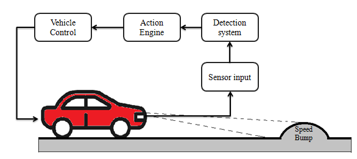
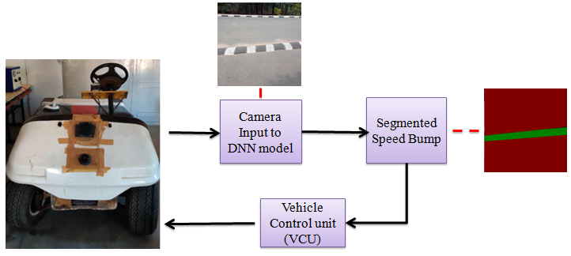
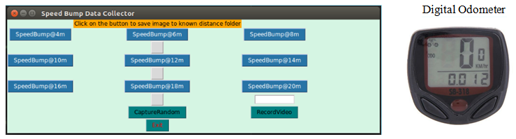
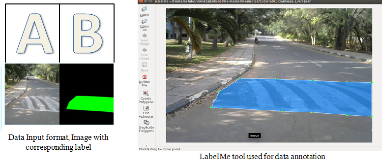
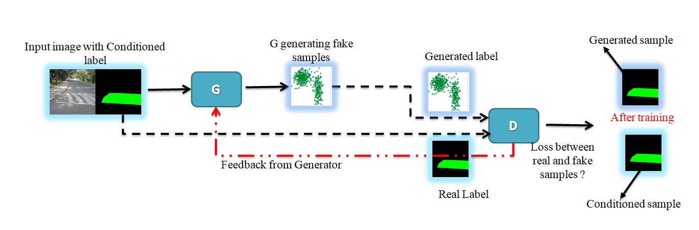
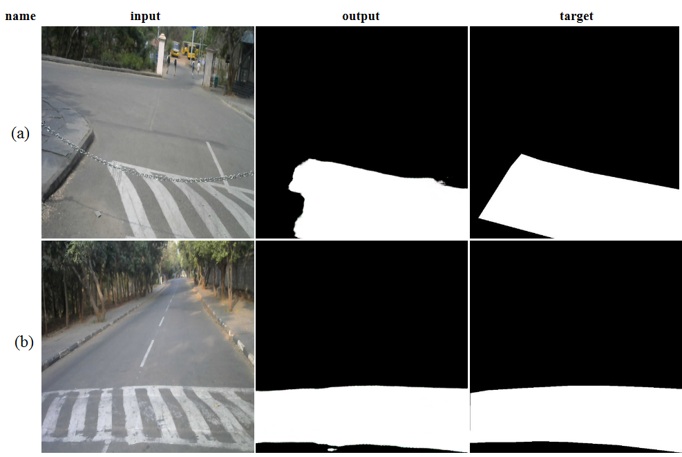
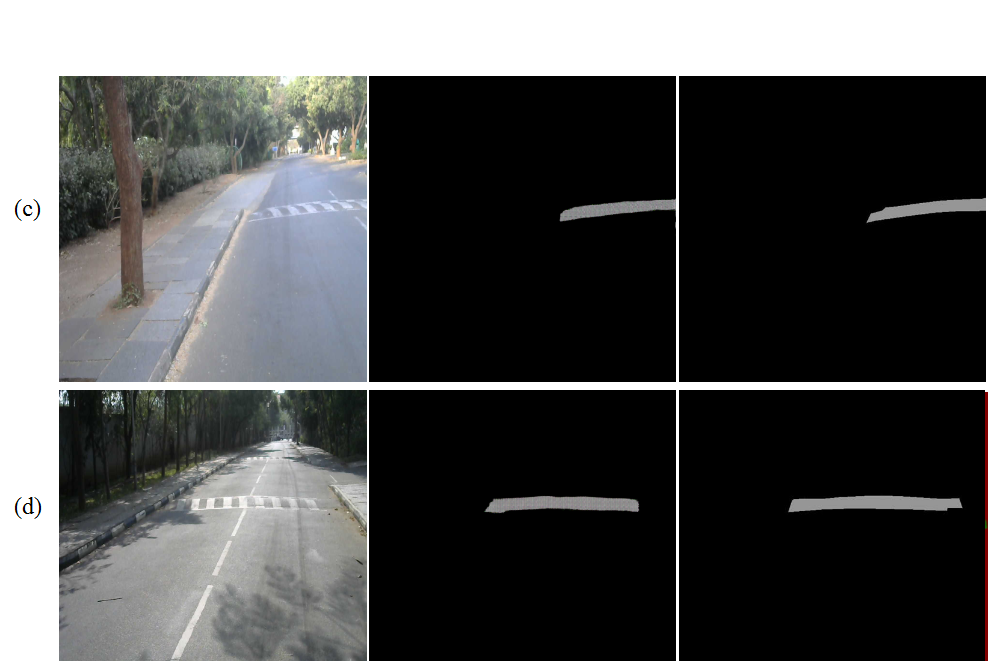
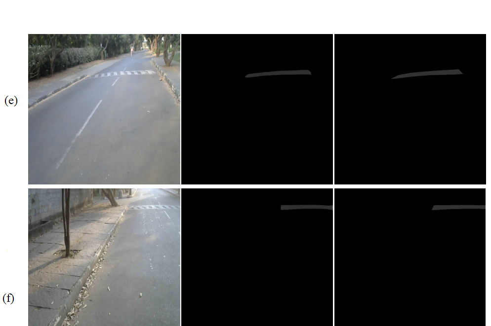

# Speed Bump Detection and Distance Estimation Using GANs

The intervention of AI technology and self-driving vehicles changed the transportation systems. The current self-driving vehicles demands reliable and accurate information from various functional modules. One of the major module accommodated in vehicles is object detection and classification. In this paper a speed bump detection approach is developed for slow moving electric vehicle platform. The developed system uses monocular images as input and segment the speed bump using GAN network. The results obtained by new approach shows the GAN network is capable of segmenting various types of speed bumps with good accuracy. This new alternative approach shows the ability of GANs for speed bump detection application in self-driving vehicles.

## Speed Bump detection methods
Speed bump detection was the major challenge from year’s back and various approaches were
developed to address this issue. Some earlier approach for speed bump detection are as follows.

     1. Conventional image processing
     2.Depth sensors
     3.Accelerometer-based detection
     4.AI and ML

 

## Implementation Platform

The proposed speed bump segmentation module is implemented in an electric vehicle platform.
The vehicle platform is equipped with a camera that feeds the input to GAN model. The
output from the model is processed and sends a control signal to the vehicle control unit(VCU).
VCU actuates the breaking system to stop the vehicle. The data flow diagram and implementation
platform is given in below The NVIDIA Jetson TX1 is used as the computational platform to run
the trained model in the vehicle
 

## Data and Data Collection

Considering the Indian road conditions there are different types of speed bumps present on the road. The different condition for detection of speed bump like bumps with markings and without markings, with faded paint, during low light conditions, occluded speed bumps etc. The data was collected covering all possible detection conditions mentioned above.
Speed bump images were captured from a known distance. To capture the images from a known distance a tool was developed using python. refer Data_Collector.py file to checkout the data collection tool.

 

##  Data Annotation
The input format of the
data which needs to fed in to the GAN network is both original image and its corresponding label concatenated as a single image. A sample is as shown in fig
 

Labelme :https://github.com/wkentaro/labelme
Download the annotation tool from this repository.

## Pix2Pix
copy repository
https://github.com/affinelayer/pix2pix-tensorflow
create databse folder and put the annoted images within test, train,val folder. 
Following fig illustrating the high level training procedure for implementing cGAN for Speed bump segmentation.
First the input will be served to generator along wit the conditioned label(i.e. segmented speed bump). The labeling needs to be done manually.  
At the start of training generator will start generating samples starting with random noise, the discriminator will find the loss between conditioned and generated label and give feedback to generator.
This loop will continue and generator becomes more  and more accurate to generate labels close to original as training progresses.
 

## Model Training
The Model was trained for collected images and after changing few parameters without making any architectural changes we were able to achive reasonable results.
## Results
 
 
 

## Publication
S. O. Patil, V. V. Sajith Variyar. and K. P. Soman, ”Speed Bump Segmentation an Application of
Conditional Generative Adversarial Network for Self-driving Vehicles,” 2020 Fourth International
Conference on Computing Methodologies and Communication (ICCMC), Erode, India, 2020, pp.
935-939, doi: 10.1109/ICCMC48092.2020.ICCMC-000173.

## Referances
Labelme :https://github.com/wkentaro/labelme
Pix2pix :https://github.com/affinelayer/pix2pix-tensorflow

